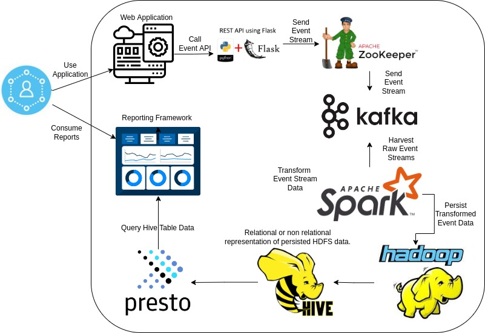
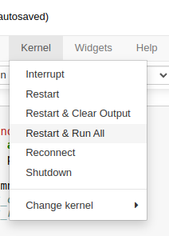
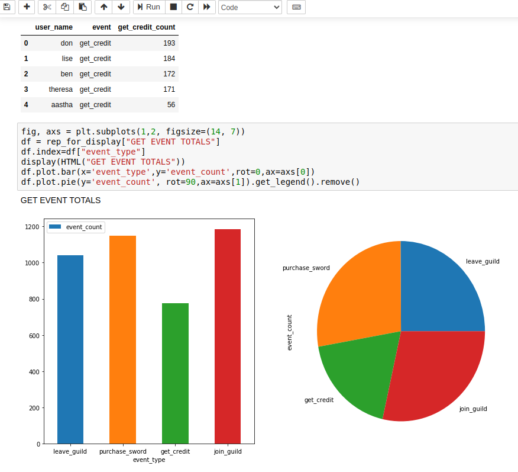
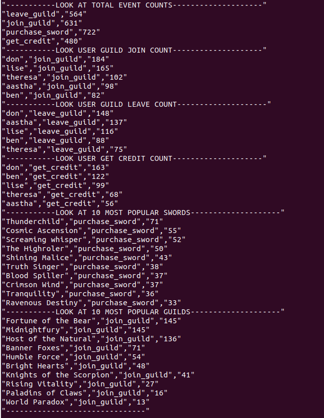

# Data Streaming Pipeline Demonstration   


## Visual Overview



## Background

The objective of this project is to demonstrate an understanding and the ability to create:

* Docker based containerization.
* Docker virtual networks.
* API endpoints (Python Flask in this case).
* Message broker services (Kafka and Zookeeper).
* Transformation Engines (Spark).
* Persistent distributed redundant query-able store (HDFS).
* Hive SQL tables.
* Synthetic Parameterized Event Generation.
* Event Transformation.
* Persist streaming events.
* Schema organization.
* Report generation at tail end of pipeline
* Make the process re-producible.


## Limitations

This will not work on an ARM / M1 / M2 box as the images are for the X86 architecture.

## Cautions

The first time this project is run, depending on your internet connection, it could take some time to download the initial docker images required by the system.

## Pre-Requeisites

* Docker
* Docker-Compose
* Python
* Python3 is Python
* Bash

If you're installing on a bare bone machine or a newley created virtual machine image, the command below will install pre-requisitves.

```
sudo su
apt update && apt install docker -y && apt install docker-compose -y && apt install git -y && apt install python-is-python3 -y
```

## Running The Project Out of the Gate

If you are on a machine which has all appropriate pre-requisites installed, the following command will begin the pipeline.

```
git clone https://github.com/Don-Irwin/data_streaming_pipeline && cd /data_streaming_pipeline && . run.sh
```

Alternatively -- you can execute each of the commands independently.

```
git clone https://github.com/Don-Irwin/data_streaming_pipeline 

```

```
cd ./data_streaming_pipeline/
```

```
. run.sh
```

## Viewing System Activity and Output

There are many ways to view system activity and output.  

We will demostrate a few:

### Open Open the Created Jyputer Notebook

Once the system is running the jupyter notebook will be exposed on the system.

* Open the notebook

It can be accessed (if running locally) by the following command.

http://localhost:5555/notebooks/system_demo.ipynb

Or if it is being run on a separate server, run the following command.

http://[IP-ADDRESS-OF-SERVER]:5555/notebooks/system_demo.ipynb

* Run all cells.



* View output.



### Observe The Console

As the system is running it will continue to generate synthetic streaming events, which are pseristed to sql tables.

After every 500 synthetic event generations, the console will query Presto tables and 



### Explore the Images and Bash Files

There are six separate server containers in this solution, they may all be explored different ways.

* Explore via bash files:

There are a number of bash files in the directory which query the servers.

```
ls *.sh
```

* Explore the Docker Images Directly:

To get onto a specific docker image.  The command below executes the bash command against the "presto" server within docker / docker-compose.

```
docker-compose exec presto bash
```

