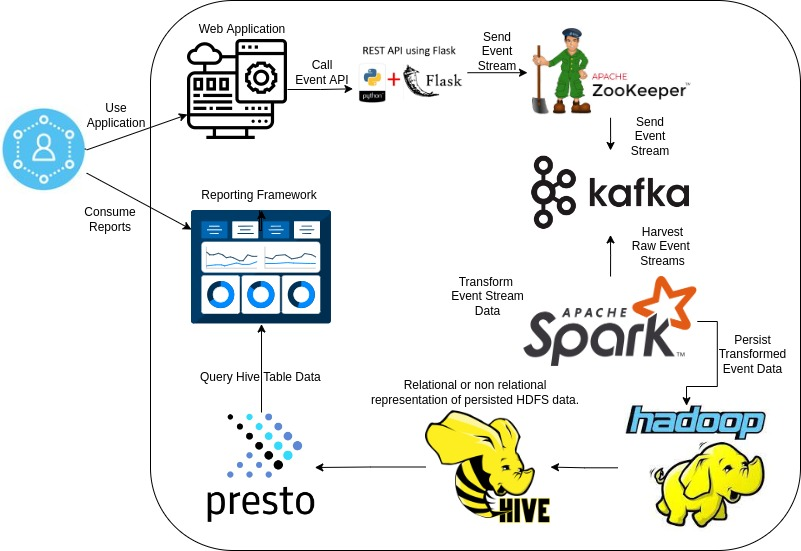

# Data Streaming Pipeline Demonstration   



## Background:

The objective of this project is to demonstrate an understanding and the ability to create:

* Docker based containerization.
* Docker virtual networks.
* API endpoints (Python Flask in this case).
* Message broker services (Kafka and Zookeeper).
* Transformation Engines (Spark).
* Persistent distributed redundant query-able store (HDFS).
* Hive SQL tables.
* Synthetic Parameterized Event Generation.
* Event Transformation.
* Persist streaming events.
* Schema organization.
* Report generation at tail end of pipeline
* Make the process re-producible.


## Limitations

This will not work on an ARM / M1 / M2 box as the images are for the X86 architecture.

## Pre-Requeisites

* Docker
* Docker-Compose
* Python
* Python3 is Python
* Bash

If you're installing on a bare bone machine or a newley created virtual machine image, the command below will install pre-requisitves.

```
sudo su
apt update && apt install docker -y && apt install docker-compose -y && apt install git -y && apt install python-is-python3 -y
```

## Running The Project Out of the Gate

If you are on a machine which has all appropriate pre-requisites installed, the following command will begin the pipeline.

```
git clone https://github.com/Don-Irwin/data_streaming_pipeline && cd /data_streaming_pipeline && . run.sh
```

Alternatively -- you can execute each of the commands independently.

```
git clone https://github.com/Don-Irwin/data_streaming_pipeline 

```

```
cd ./data_streaming_pipeline/
```

```
. run.sh
```

